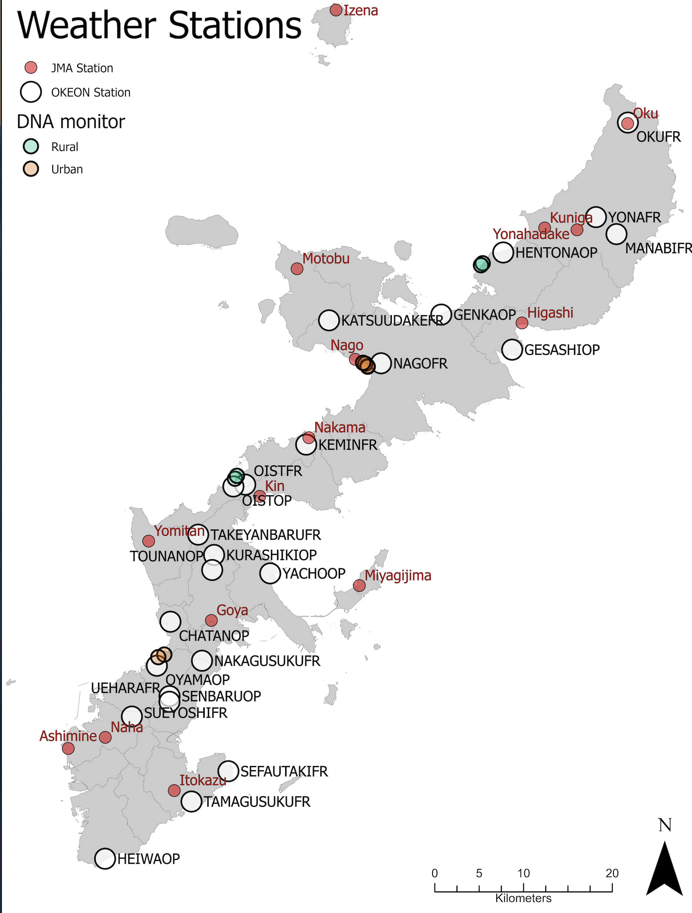

```{r setup, include=FALSE}
knitr::opts_chunk$set(echo = FALSE, warning=FALSE)
```


Loading packages
```{r packages, include=FALSE}
library(ggplot2)
library(tidyverse)
library(jcolors)
library(ggfortify)
library(lubridate)
```

## Getting rain and wind data and cleaning

Kenneth Dudley downloaded the data from [JMA](https://www.jma.go.jp/jma/indexe.html). This is 10 min data.
Here is a map with the weather stations in Okinawa also made by Kenneth.


Big rain events seems
```{r getting data and cleaning rain}

rawind<- read.csv("~/Documents/Projects OIST/RS/DNA year monitoring project/Raw_rain_wind/RainWind_10min_2020_Nov_to_2021_Oct.csv")
sumrain<- rawind %>% 
  mutate(dates = ymd_hms(eventDate),
         day = date(dates)) %>% 
  group_by(day, site_id_en) %>% 
  summarise(acc_Rain = sum(precipitation_mm))

#some stations dont have rain data so it is better to remove them

new_sumrain<- sumrain[!grepl("Naha|Nago", sumrain$site_id_en),]


#lets make a lineplot with accumulated rain per day and site 

rainplot<- ggplot(new_sumrain, aes(x=day)) + 
  geom_line(aes(y=acc_Rain), size=0.5, color="black")+
  scale_y_continuous(name = "Accumulated rain (mm)")+ 
  facet_grid(site_id_en ~ .)+ 
  theme_bw()

rainplot
```


Lets see the wind intensity
```{r EDA wind}

meanwind<- rawind %>% 
  mutate(dates = ymd_hms(eventDate),
         day = date(dates)) %>% 
  group_by(day, site_id_en) %>% 
  summarise(mean_wind = mean(windAvgSpeed_ms))
  
meanmaxwind<- rawind %>% 
  mutate(dates = ymd_hms(eventDate),
         day = date(dates)) %>% 
  group_by(day, site_id_en) %>% 
  summarise(mean_maxwind = mean(windMaxSpeed_ms))
  
windy <- left_join(meanwind, meanmaxwind, by=c('day', 'site_id_en'))

#some stations dont have rain data so it is better to remove them

windytot<- windy[!grepl("Goya|Yomitan|Kuniga", sumrain$site_id_en),]


#lets make a lineplot with accumulated rain per day and site 

windplot<- ggplot(windytot, aes(x=day)) + 
  geom_line(aes(y=mean_wind), size=0.5, color="black")+
  geom_line(aes(y=mean_maxwind), size=0.5, color="grey")+
  scale_y_continuous(name = "Wind intensity (m/s)")+ 
  facet_grid(site_id_en ~ .)+ 
  theme_bw()

windplot
```

Now I need to create a df including all the physicochemical parameters I want to compare and the wind, rain and tide data. 
I am presenting the physicochemical parameter in the primary axes and and the wind, rain, tide in the secondary one.

Lets join everything together
```{r join all data}

#start with Rinko
rinkototal <- read.csv("~/Documents/GitHub/DNA_monitOki/Environmental parameters/rinko_all_outliers_removed.csv")
sept_rinko<- read.csv("~/Documents/GitHub/DNA_monitOki/Environmental parameters/sept_no_outliers.csv")

#make the number of the columns in both files the same
sept_rinko[1]<- NULL
rinkototal[21]<- NULL

#join both df
rinko_join<- rbind(rinkototal, sept_rinko)

#remove unwanted col
lesscolrinko<- rinko_join[ , -c(1,2,7,18:20)]
set_time<- lesscolrinko %>% 
  mutate(timenew = lubridate::hms(lesscolrinko$time))
set_time$date <- ymd(set_time$date)
set_time$timenew<- hms(set_time$timenew)
set_time$timenew <- period_to_seconds(set_time$timenew)  

#calculate mean/sd
mean_sd_rinko<- set_time %>%
  group_by(date, location, sample) %>%
  summarise(across(
    .cols = is.numeric, 
    .fns = list(Mean = mean, SD = sd), na.rm = TRUE, 
    .names = "{col}_{fn}"
    ))

mean_sd_rinko$timenew_Mean <- seconds_to_period(mean_sd_rinko$timenew_Mean) 
mean_sd_rinko<- mean_sd_rinko[ , -c(25)]

#substitute strings with different patterns
#in the location column

mean_sd_rinko$location<- gsub('Ｒ１', 'R1',
           gsub('Ｒ２', 'R2',
           gsub('Ｕ１', 'U1', 
           gsub('Ｕ２', 'U2', mean_sd_rinko$location))))

#in the sample column
mean_sd_rinko$sample<- gsub('Ｒ１Ｃ', 'R1C',
           gsub('Ｒ１Ｎ', 'R1N',
           gsub('Ｒ１Ｓ', 'R1S', 
           gsub('Ｒ２Ｃ', 'R2C', 
           gsub('Ｒ２Ｎ', 'R2N', 
           gsub('Ｒ２Ｓ', 'R2S',       
           gsub('Ｕ１Ｃ', 'U1C', 
           gsub('Ｕ１Ｎ', 'U1N',
           gsub('Ｕ１Ｓ', 'U1S',
           gsub('Ｕ２Ｃ', 'U2C',
           gsub('Ｕ２Ｎ', 'U2N',
           gsub('Ｕ２Ｓ', 'U2S', mean_sd_rinko$sample))))))))))))

# Adding column with position (C, N, S) based on the sample column:
mean_sd_rinko<- mean_sd_rinko %>%
  mutate(Position = case_when(
    endsWith(sample, "C") ~ "C",
    endsWith(sample, "S") ~ "S",
    endsWith(sample, "N") ~ "N"
    ))

#now we join the rain data
df.wide <- pivot_wider(new_sumrain, names_from = site_id_en, values_from = acc_Rain)
df.wide$date <- ymd(df.wide $day)

#join tables
rainrinko<- mean_sd_rinko %>%
  full_join(df.wide, by = 'date', keep = TRUE)

#plot rain accumulation vs environmental parameters


```


