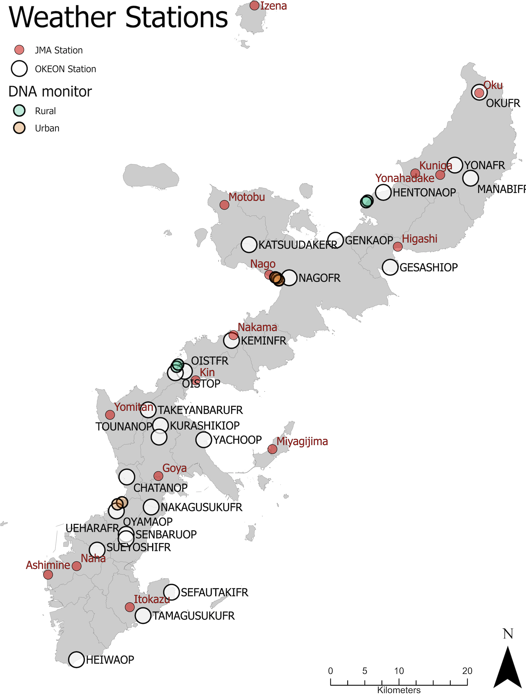

```{r setup, include=FALSE}
knitr::opts_chunk$set(echo = FALSE, warning=FALSE)
```


Loading packages
```{r packages, include=FALSE}
library(ggplot2)
library(tidyverse)
library(jcolors)
library(ggfortify)
library(lubridate)
```

## Getting rain and wind data and cleaning

Kenneth Dudley downloaded the data from [JMA](https://www.jma.go.jp/jma/indexe.html). This is 10 min data.
Here is a map with the weather stations in Okinawa also made by Kenneth.



```{r getting data and cleaning}

rawind<- read.csv("~/Documents/Projects OIST/RS/DNA year monitoring project/Raw_rain_wind/RainWind_10min_2020_Nov_to_2021_Oct.csv")
sumrain<- rawind %>% 
  mutate(dates = ymd_hms(eventDate),
         day = date(dates)) %>% 
  group_by(day, site_id_en) %>% 
  summarise(acc_Rain = sum(precipitation_mm))

#some stations dont have rain data so it is better to remove them
#lets make a lineplot with accumulated rain per day and site 

rainplot<- ggplot(sumrain, aes(x=day)) + 
  geom_line(aes(y=acc_Rain), size=0.5, color="#D33B44")+
  scale_y_continuous(name = "Accumulated rain (mm)")+ 
  facet_wrap(~site_id_en)+ 
  theme_bw()

```
